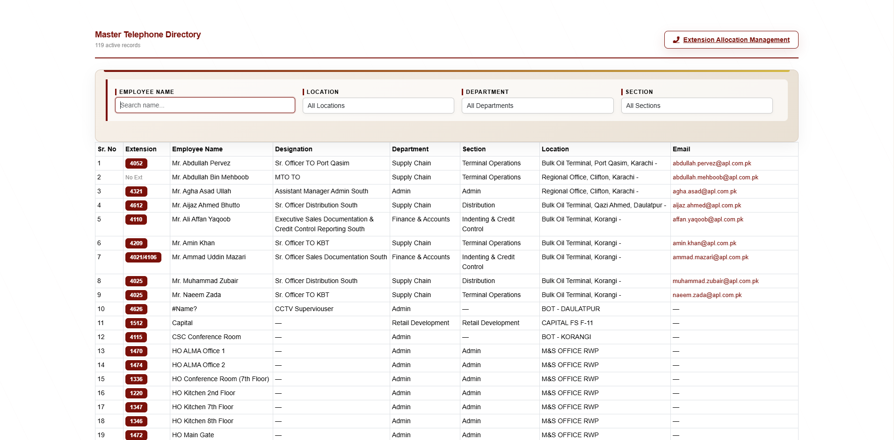
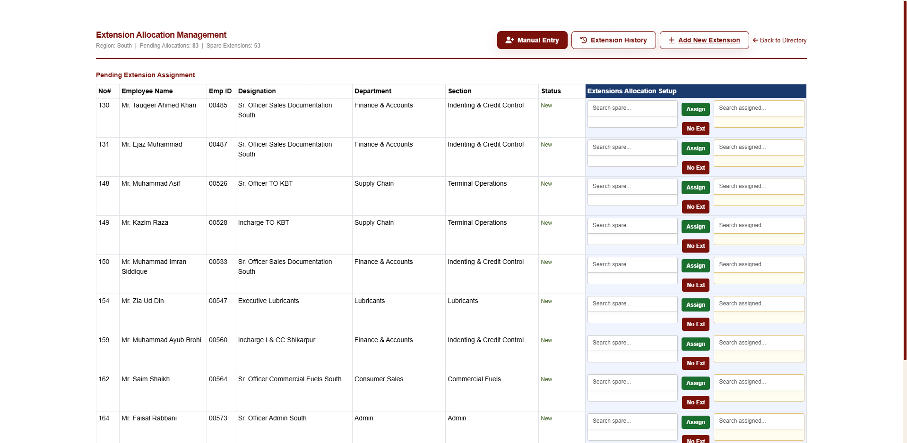
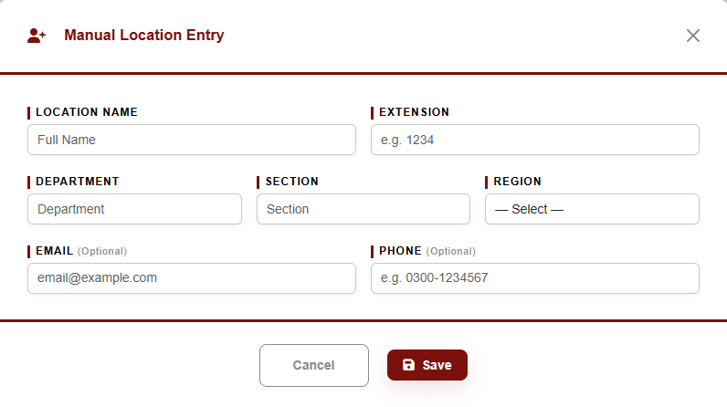
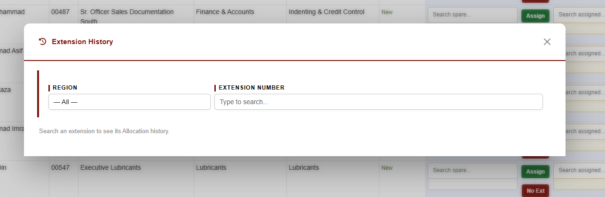
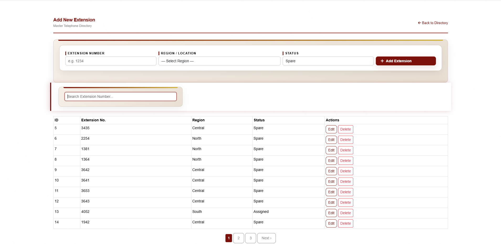
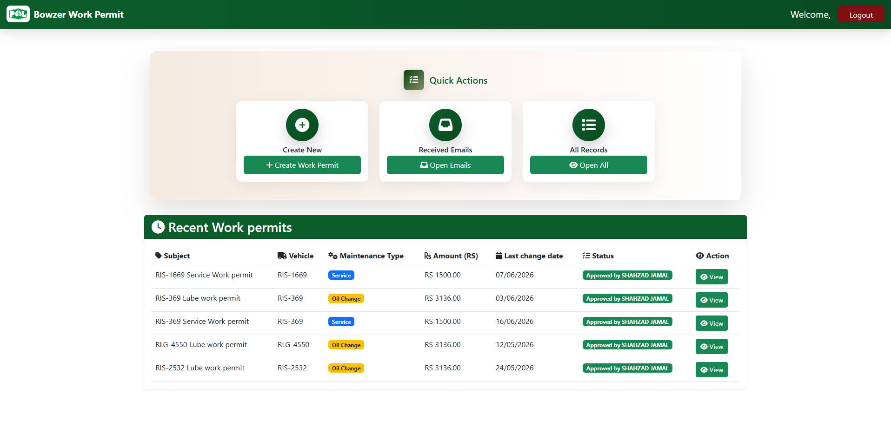
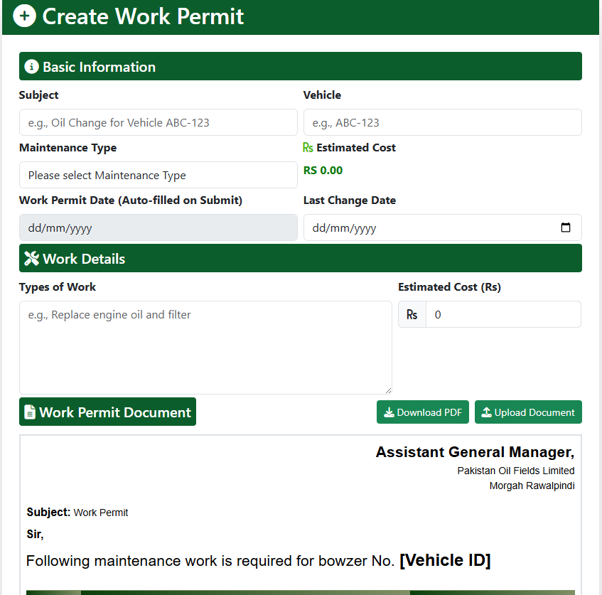
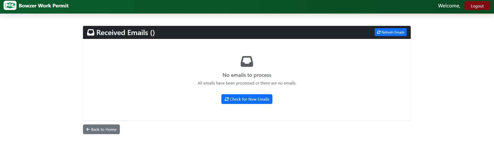
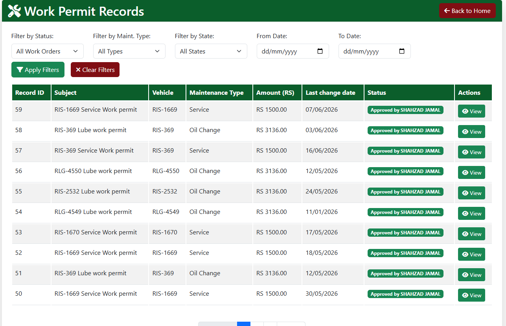
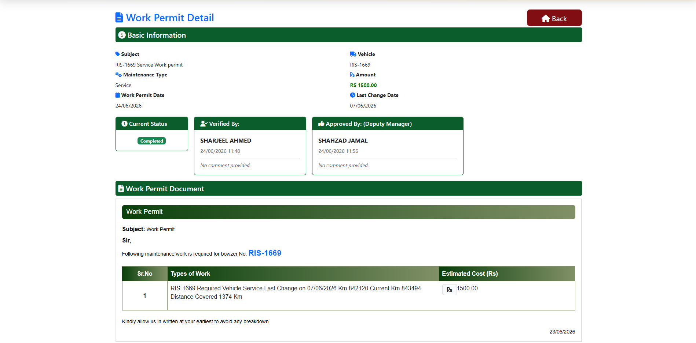

<h1 align="center">Hi 👋, I'm Yasir Ejaz</h1>

<h3 align="center">Python Developer | Backend Engineer | Exploring AI Engineering</h3>

  

---

### 🧑‍💻 About Me
 
- 🔭 Currently working as a **Backend Developer** at **AttockIT**, designing and building end-to-end internal enterprise systems used in daily business operations
- 🛠️ I build full-stack ERP-style Django applications integrated with **Oracle HRMS**, **PostgreSQL**, and automated approval workflows
- ⚙️ Hands-on experience customizing and implementing **Odoo ERP** — modules, automation, and business process configuration using Python & Odoo Studio
- 🎯 **Goal:** Transitioning from backend development into **AI Engineering** — building intelligent, production-grade systems powered by ML/LLMs
- 🌱 Currently strengthening my foundations in AI/ML to bridge backend engineering with applied AI development
- 📫 Reach me at: **ejazyasir1974501@gmail.com**
---

## 🏗️ Systems I've Built

### 1. Travel Expense Settlement System

Digitized employee travel advance and expense claim process. Consolidates multiple travel requests into a single settlement, auto-calculates entitlements from Oracle HRMS, and removes manual file uploads via an in-system breakup form.

**Screenshots:**

<i>For normal users, the dashboard displays only the Employee section and Open Settlement Records. The remaining two management cards are hidden and are visible only to management users.</i>

  

<i>After logging in, the user can view only their own travel requests. They select a travel request, and any saved expense breakup appears as a draft below. The approvers are automatically loaded based on the user's login location and the system setup.</i>

  

<i>When the user selects a travel request and clicks OK, the selected requests are displayed in an interactive travel model with key details and an Open Breakup button.</i>

  

<i>The travel advance for the selected request is displayed at the top. As the user enters expenses and selects the entitlement type, the system automatically calculates the total expense and the remaining balance (Advance - Expenses).

Users can also attach supporting documents. Based on the logged-in user's designation, the boarding and lodging entitlement is automatically applied. The user cannot enter an amount higher than the allowed limit. A date range is provided so multiple days of travel can be covered easily.</i>

  

<i>When the user saves the page, it becomes read-only for them. It remains fully editable for the Super User. For each assigned approver, only their designated section is editable, while the rest of the form is read-only. Approvers can add their comments and forward the request to the next approval level.</i>

  

---

### 2. Master Telephone Directory (MTD) System

Centralized, Oracle HRMS-integrated employee extension management system. Auto-detects new, transferred, and inactive employees, handles region-based extension allocation, and provides a public directory with real-time search.

**Screenshots:**

<i>A real-time search is available at the top, allowing users to search by employee name. Additional filters are also provided. The list below displays all records, including extension numbers and other details. Extension numbers are assigned by the MIS user, and only those assigned extensions are shown.</i>

  

<i>This module is for MIS users to assign new or spare extensions to new and transferred employees. Multiple extensions can be assigned to a single employee, and shared extensions are also supported. Employee data is synced from the HRMS and updates automatically in real time.</i>

  

<i>This module is used to manually add extension details for physical locations such as check posts, guard rooms, and other non-employee locations.</i>

  

<i>This module maintains the extension assignment history. It tracks which employee was previously assigned each extension and records all assignment changes. A search option is available at the top, with matching records displayed below.</i>

  

<i>This module is used to add new extensions by region. The list below shows all extensions and their current status. When an employee leaves, their extension is automatically updated to Spare and becomes available for reassignment.</i>

  

---

### 3. Bowzer Filter & Oil Change Tracking System

Automated vehicle maintenance tracking system that reads driver emails, extracts work permit details, and logs filter/oil change records — replacing manual paper registers.

**Screenshots:**

<i>This is the main dashboard. The top cards display form statistics, while the email section shows data from the database related to work permit requests. The bottom section displays the most recently created work permits.</i>

  

<i>This module is used to create Work Permit requests. Users enter all the required information, and the system generates both the Work Permit form and the related email automatically.</i>

  

<i>This module reads received emails from the email server based on the subject. It extracts the Work Permit details and creates a draft automatically. The draft can then be completed with additional information and submitted into the workflow.</i>

  

<i>This module displays all created Work Permits. Filters are available at the top, while the list below shows the permit details and its current workflow stage.</i>

  

<i>This module shows the complete workflow history, including user actions, comments, approvals, timestamps, and other workflow details.</i>

  

---

### 4. Odoo ERP Implementation
 
Implemented and customized Odoo ERP to automate core business processes across departments — reducing manual work and standardizing operations on a single platform.
 
**What I did:**
- Customized existing Odoo modules and built new functionality using **Odoo Studio** and **Python**
- Automated recurring business workflows that were previously handled manually
- Configured access rights, approval steps, and business rules to match internal company processes
- Provided ongoing support and issue resolution for live ERP operations
**Screenshots:**
 

<i>Customized Odoo module configured to match internal business workflow requirements.</i>

  

---

## 🚧 Currently Exploring: AI Engineering *(Work in Progress)*

> This section is actively being built as I transition into AI Engineering.

**Skills:**

- 🔲 *(To be added)*

**Projects:**

- 🔲 *(To be added)*

---

## 🧰 Tech Stack

**Languages:** Python, SQL, C++, Dart

**Frameworks:** Django, Flask

**ERP:** Odoo (Customization, Studio)

**Databases:** PostgreSQL, Oracle

**Tools:** Git, Gitea, Linux

**Other:** REST APIs, Deployment, Active Directory

---

## 📫 Connect With Me

- 📧 Email: ejazyasir1974501@gmail.com
- 📍 Location: Rawalpindi, Pakistan
