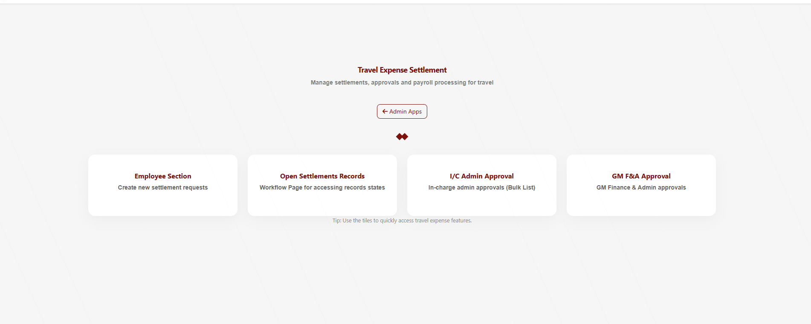
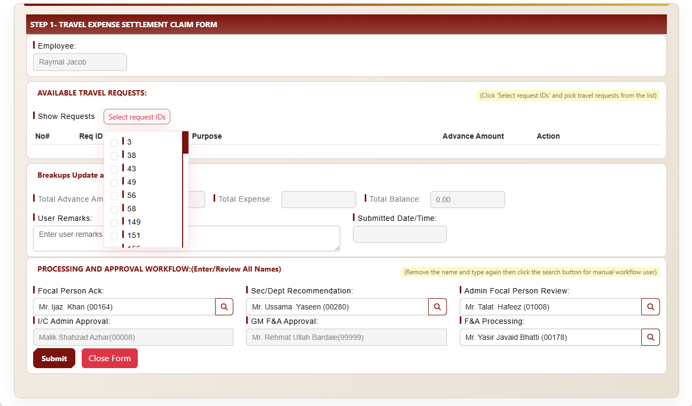
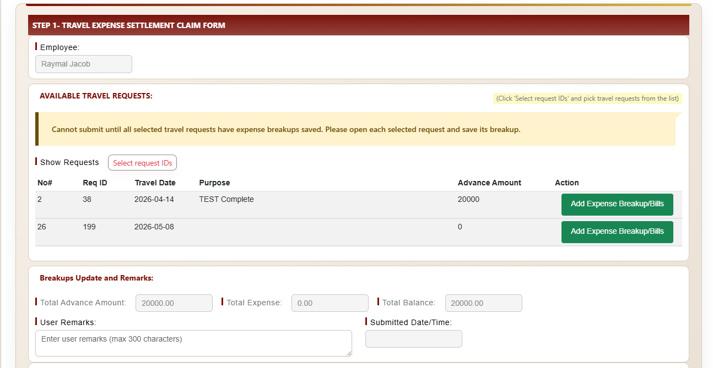
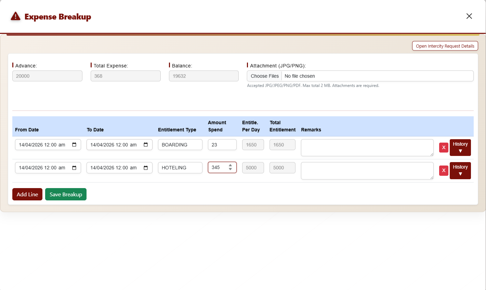
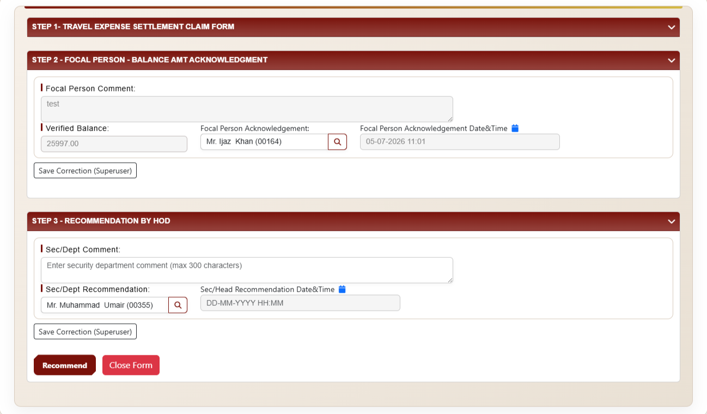

<h1 align="center">Hi 👋, I'm Yasir Ejaz</h1>

<h3 align="center">Python Developer | Backend Engineer | Exploring AI Engineering</h3>

  

---

### 🧑‍💻 About Me

- 🔭 Currently working as a **Backend Developer** at **AttockIT**, building internal enterprise systems with **Django**
- 🛠️ I design and build full-stack ERP-style systems integrated with **Oracle HRMS** and **PostgreSQL**
- 🌱 Currently exploring **AI Engineering** — expanding into ML/LLM-based systems
- 📫 Reach me at: **ejazyasir1974501@gmail.com**

---

## 🏗️ Systems I've Built

### 1. Travel Expense Settlement System

Digitized employee travel advance and expense claim process. Consolidates multiple travel requests into a single settlement, auto-calculates entitlements from Oracle HRMS, and removes manual file uploads via an in-system breakup form.

**Screenshots:**

  

  

  

  

  

---

### 2. Master Telephone Directory (MTD) System

Centralized, Oracle HRMS-integrated employee extension management system. Auto-detects new, transferred, and inactive employees, handles region-based extension allocation, and provides a public directory with real-time search.

**Screenshots:**

  

  

---

### 3. Bowzer Filter & Oil Change Tracking System

Automated vehicle maintenance tracking system that reads driver emails, extracts work permit details, and logs filter/oil change records — replacing manual paper registers.

**Screenshots:**

  

  

---

### 4. Odoo ERP Implementation

Customized Odoo ERP modules using Python & Odoo Studio to automate and streamline core business workflows across departments.

**Screenshots:**

  

---

## 🚧 Currently Exploring: AI Engineering *(Work in Progress)*

> This section is actively being built as I transition into AI Engineering.

**Skills:**

- 🔲 *(To be added)*

**Projects:**

- 🔲 *(To be added)*

---

## 🧰 Tech Stack

**Languages:** Python, SQL, C++, Dart

**Frameworks:** Django, Flask

**ERP:** Odoo (Customization, Studio)

**Databases:** PostgreSQL, Oracle

**Tools:** Git, Gitea, Linux

**Other:** REST APIs, Deployment, Active Directory

---

## 📫 Connect With Me

- 📧 Email: ejazyasir1974501@gmail.com
- 📍 Location: Rawalpindi, Pakistan
